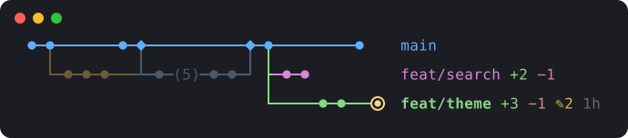

# claude-statusline-gitgraph

一张**横向**的 git 分支图，常驻在 Claude Code 输入框下方：主线在上，分支在下，时间从左往右走。一眼就能看出你在哪个分支、比 main 多了几次提交、有没有改了没提交的文件。



- **简洁**：不显示提交说明，只画结构。已经合并完的旧分支会变暗，太长的分支会折叠成 `(5)`。
- **信息刚好够用**：`+3 −1` 表示比 main 多几次、少几次提交，`↑2 ↓1` 表示和远程仓库差几次提交，`✎2` 表示有几个文件改了还没提交，`1h` 表示离上次提交过了多久。
- **对新手友好**：自带符号表（`legend`）和一个 5 分钟的学习模式（`learn`）。学习模式在临时的沙盒仓库里一步步演示分支是怎么长出来、怎么合并的，不会碰你的项目。
- **零依赖**：一个 Python 文件，只用标准库，有 `git` 和 `python3` 就能跑。

## 快速开始

```bash
git clone https://github.com/NowhereMan-in-Galaxy/claude-statusline-gitgraph.git ~/tools/claude-statusline-gitgraph
cd ~/tools/claude-statusline-gitgraph

python3 gitgraph.py learn            # 学习模式：跟着走一遍分支的日常用法
python3 gitgraph.py legend           # 符号表：每个符号是什么意思
python3 gitgraph.py ~/your/project   # 画出某个仓库的分支图
```

## 放进 Claude Code 的状态栏

在 `~/.claude/settings.json` 里加上（路径换成你 clone 的位置）：

```json
{
  "statusLine": {
    "type": "command",
    "command": "python3 ~/tools/claude-statusline-gitgraph/gitgraph.py --statusline",
    "refreshInterval": 10
  }
}
```

- Claude Code 每轮对话后都会运行一次这个命令，另外每 `refreshInterval` 秒再运行一次，把输出显示在输入框下方。
- `--statusline` 会从 Claude Code 传来的信息里读出当前目录，所以换项目时图会自动跟着换。
- 不在 git 仓库里时什么都不输出，状态栏保持空白。

**已经有自己的状态栏脚本？** 在脚本末尾加一行，把图接在原来的内容下面：

```bash
printf '\n%s' "$(python3 ~/tools/claude-statusline-gitgraph/gitgraph.py "$cwd")"
```

## 看懂这张图

```
●─●───────●─◆───────────◆─●─────────●    main
  ╰─●─●─●───┴─●─(5)─●─●─╯ ├─●─●          feat/search +2 −1
                          ╰─────●─●───◉  feat/theme +3 −1 ✎2 1h
```

| 符号 | 意思 |
|---|---|
| `●` | 一次提交（一个存档点） |
| `◉` | 你现在所在的位置（HEAD） |
| `◆` | 合并提交：有分支在这里并回主线 |
| `(5)` | 折叠起来的 5 次提交 |
| `╰` `╯` | 分支从这里分出去 / 在这里合并回来 |
| `├` | 两个分支从同一个存档点分出去 |
| `┴` | 一个分支刚合并，下一个紧接着分出去 |
| `┼` | 两条线在这里交叉而过 |
| `┄` | 分叉点太早，不在图里 |
| 暗色的线 | 已经合并完的旧分支 |
| `+3` / `−1` | 比 main 多 3 次 / 少 1 次提交 |
| `↑2` / `↓1` | 还有 2 次提交没推送 / 远程有 1 次提交没拉下来 |
| `✎2` | 有 2 个文件改了还没提交 |
| `1h` | 离这个分支上次提交过了多久（m 分钟 · h 小时 · d 天） |
| `+2 more` | 还有 2 个分支放不下没画出来 |
| **加粗的分支名** | 你现在所在的分支 |

## 调整

`gitgraph.py` 开头有几个常量，可以按喜好改：

| 常量 | 默认 | 作用 |
|---|---|---|
| `MAX_COLS` | 30 | 最多画多少列，决定图有多宽 |
| `MAX_ROWS` | 3 | main 下面最多画几行分支 |
| `FOLD_OVER` | 4 | 一个分支连续超过几次提交就折叠 |
| `COLORS` | — | 各部分的颜色（终端 256 色编号） |

设置环境变量 `NO_COLOR=1` 或加上 `--no-color` 参数，可以关闭颜色。

## 它是怎么画出来的

见 [docs/how-it-works.md](docs/how-it-works.md)：怎么从 git 读出分叉和合并、为什么按拓扑顺序排列而不按时间排、字符格子里的拐角是怎么合成的。

## English

A horizontal git branch graph for the Claude Code status line (or any terminal). The trunk is on top, branches below, and time flows left to right. Each branch shows how far it is ahead of and behind `main`, how far it is ahead of and behind its upstream, how many files are uncommitted, and how long ago its last commit was. Run `python3 gitgraph.py learn` for a guided tour in a throwaway sandbox repository (in Chinese). It is a single Python file with no dependencies beyond the standard library. The status line setup is shown above.

## 许可证

[MIT](LICENSE)
