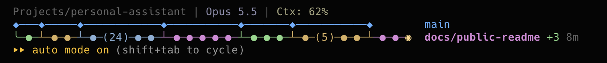
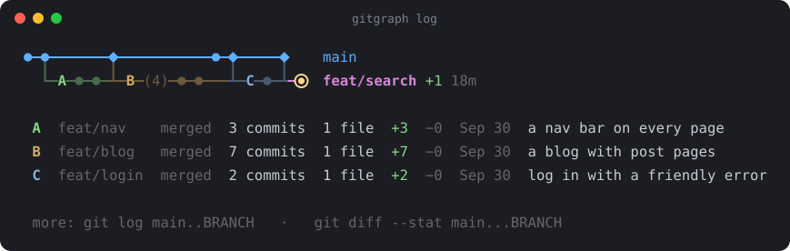
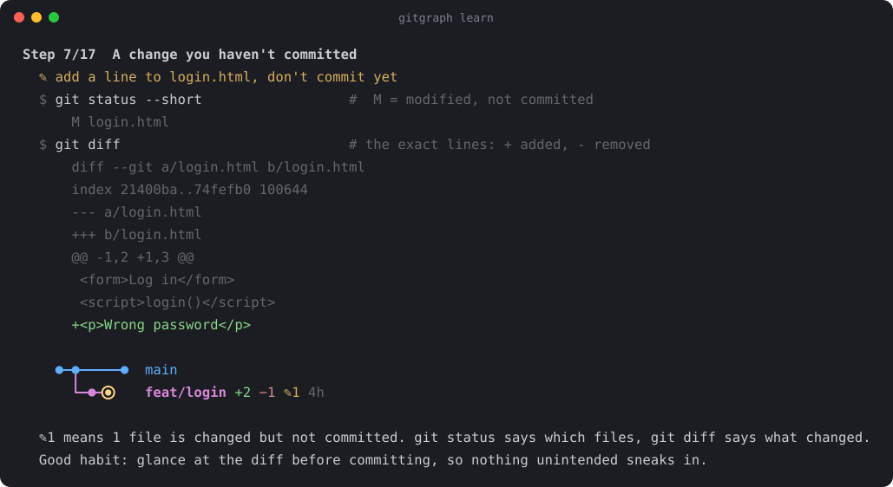
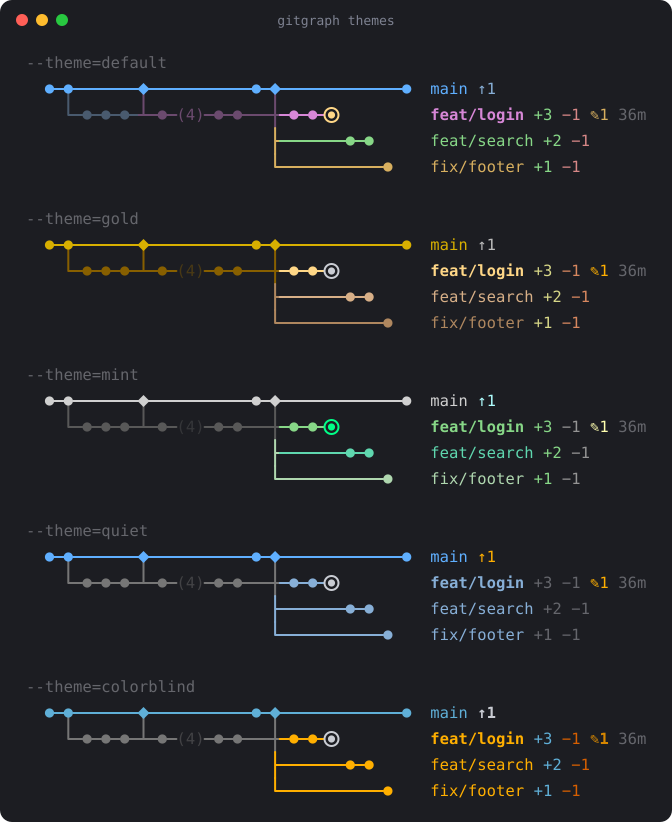

# claude-statusline-gitgraph

**English** · [中文](#中文说明)

Most status lines tell you which branch you're on. This one shows you **the shape of your history**: a live, horizontal git graph under the Claude Code prompt. The trunk runs across the top, branches fork off below, and time flows left to right.


## Install: one sentence to your agent

Paste this into Claude Code:

```text
Install https://github.com/NowhereMan-in-Galaxy/claude-statusline-gitgraph for me by following its INSTALL.md.
```

It clones the repo, adds the graph to your status line (keeping the status line you already have), and sets up the `gitgraph` command. [INSTALL.md](INSTALL.md) is the exact list of steps it follows. Rather do it yourself? See [Quick start](#quick-start).

## Built for coding with an agent

When Claude writes the code, it's easy to lose track of what happened to your repository. With the graph under the prompt, you see it as it happens:

- **Claude edited files but didn't commit?** `✎3` appears.
- **Claude made a branch and committed on it?** A new row grows, with `+3`.
- **Work that exists only on your laptop?** `↑2` sits there until you push.

It also nudges good habits, especially if you're new to git: commit in small steps, branch for each feature, merge when done, push often. A dirty `✎` or a growing `↑` is hard to ignore.



*A real session: Claude has committed three times on `docs/public-readme` and every earlier feature branch has been merged into `main`.*

## Features

- **Glanceable.** The status line shows no commit messages, only structure. Merged branches fade, and long runs fold into `(5)`.
- **Just enough numbers.** `+3 −1` shows how far a branch is ahead of and behind main, `↑2 ↓1` compares it with its remote, `✎2` counts uncommitted files, and `12m` is the time since the last commit.
- **Details on demand.** `gitgraph log` letters each branch segment and tells you what it did.
- **Teaches git.** `gitgraph learn` is a 17-step, hands-on git tutorial that runs in a throwaway sandbox. Every command is annotated, and you watch the graph change as you go.
- **Shows teamwork.** `gitgraph demo` plays out a project where a lead agent hands work to five subagents, each on its own branch, until everything is merged and pushed.
- **Zero dependencies.** One Python file, standard library only. All you need is `git` and `python3`.
- **English and Chinese.** The language follows your system, and `--en` / `--zh` switch it.

## Quick start

```bash
git clone https://github.com/NowhereMan-in-Galaxy/claude-statusline-gitgraph.git ~/tools/claude-statusline-gitgraph
cd ~/tools/claude-statusline-gitgraph

python3 gitgraph.py ~/your/project   # the graph
python3 gitgraph.py log              # the graph, with each branch segment explained
python3 gitgraph.py learn            # the git tutorial (press Enter to step through)
python3 gitgraph.py demo             # a simulated team of subagents
python3 gitgraph.py themes           # pick a color theme
python3 gitgraph.py legend           # what every symbol means
```

## Add it to the Claude Code status line

Add this to `~/.claude/settings.json`, using the path you cloned to:

```json
{
  "statusLine": {
    "type": "command",
    "command": "python3 ~/tools/claude-statusline-gitgraph/gitgraph.py --statusline",
    "refreshInterval": 10
  }
}
```

- Claude Code runs the command after every turn, and again every `refreshInterval` seconds. It shows whatever the command prints under the prompt.
- `--statusline` reads the current folder from the JSON Claude Code sends, so the graph follows you from project to project.
- Outside a git repository it prints nothing, and the status line stays empty.

**Already have a status line script?** Append the graph to it:

```bash
printf '\n%s' "$(python3 ~/tools/claude-statusline-gitgraph/gitgraph.py --color "$cwd")"
```

## See what each branch did: `log`

The status line stays minimal. When you want the story behind the shape, run `log`. Each branch segment gets a letter, and a line below says whether it's merged or still open, how big it is, when it happened, and what it did. Merged branches use their merge message; open branches use their latest commit message.



To make it a one-word command, save this as `~/.local/bin/gitgraph` and make it executable (`chmod +x`):

```sh
#!/bin/sh
case "$1" in
  learn|legend|log|demo|themes|theme) exec python3 "$HOME/tools/claude-statusline-gitgraph/gitgraph.py" "$@" --color ;;
  *)                                  exec python3 "$HOME/tools/claude-statusline-gitgraph/gitgraph.py" log --color "$@" ;;
esac
```

Then run `gitgraph` in any terminal, or `! gitgraph` inside Claude Code. `gitgraph learn`, `gitgraph demo` and `gitgraph legend` work too.

## Learn git with it: `learn`

A beginner-friendly tour in five chapters. Every command carries a one-line comment, key steps show git's own output (`status`, `diff`, the conflict markers), and the graph redraws after each step so you can see what the command did.

| Chapter | You learn | You see |
|---|---|---|
| 1. Commits | `init`, `status`, `add`, `commit`, `log`, and how to write commit messages | `●` appear one by one |
| 2. Branches | creating a branch (and why it isn't a commit), `switch`, `diff` | a new row, `+2 −1`, `✎1` |
| 3. Merging | a clean merge, then a real conflict you resolve | `◆`, `╯`, the branch fading |
| 4. Remotes | `push`, `fetch`, `pull` against a local stand-in for GitHub | `↑2` and `↓1` come and go |
| 5. Going further | parallel branches, long branches folding | `├`, `(6)` |

It ends with a page of good habits and an everyday-commands cheat sheet. Everything runs in a temporary repository that is deleted afterwards, so your projects are never touched. Press Ctrl+C to quit at any time.



## Watch a team of agents: `demo`

What does a repository look like when several agents work on it at once? `demo` plays it out in nine steps, in a sandbox that is deleted afterwards:

1. A lead agent hands a cart, checkout, search, checkout tests and a user guide to five subagents. Each gets its own `git worktree`: a separate folder on its own branch, so they never overwrite each other's files.
2. The subagents commit side by side, and five rows grow under main: every open branch gets its own row, so none is hidden.
3. A teammate pushes a fix, and every open branch shows `−1`.
4. The lead agent reviews and merges the branches one by one. One subagent still has an uncommitted edit (`✎1`).
5. Everything is merged and pushed: no open rows, no `↑`.


## Reading the graph

```
●─●───────●─◆───────────◆─●─────────●    main
  ╰─●─●─●───┴─●─(5)─●─●─╯ ├─●─●          feat/search +2 −1
                          ╰─────●─●───◉  feat/theme +3 −1 ✎2 1h
```

| Symbol | Meaning |
|---|---|
| `●` | a commit |
| `◉` | where you are (HEAD) |
| `◆` | a merge commit: a branch came back here |
| `(5)` | 5 commits folded away |
| `╰` `╯` | a branch starts here / is merged back here |
| `├` | two branches start from the same commit |
| `┴` | one branch merged, the next starts right there |
| `┼` | two lines cross |
| `┄` | forked too long ago to fit |
| dimmed line | a branch that is already merged |
| `+3` / `−1` | 3 commits ahead of main / 1 behind |
| `↑2` / `↓1` | 2 commits to push / 1 to pull |
| `✎2` | 2 files changed but not committed |
| `1h` | time since the branch's last commit (m · h · d) |
| `+2 more: a, b` | more open branches than `MAX_OPEN`; the ones not drawn, by name |
| **bold name** | the branch you're on |

## Options

| Constant in `gitgraph.py` | Default | Controls |
|---|---|---|
| `MAX_COLS` | 30 | how many columns to draw (the graph's width) |
| `MAX_ROWS` | 3 | branch rows under main when nothing is in progress; merged branches only use these |
| `MAX_OPEN` | 8 | open branches each get a row, up to this many |
| `FOLD_OVER` | 4 | fold runs longer than this |
| `THEMES` | — | the color themes, as 256-color codes |

- **Color.** When the output is captured (piped into a file or another script), color is turned off. If the receiver can show color, as your own status line script or Claude Code's `!` can, pass `--color`. `--no-color` or `NO_COLOR=1` turns it off.
- **Theme.** Too colorful? `gitgraph themes` draws your repository in every theme. Switch with `gitgraph theme NAME`: it's saved in `~/.config/gitgraph/theme`, and the status line picks it up on its next refresh. `--theme=NAME` or `GITGRAPH_THEME=NAME` override it for one command.

  | Theme | Look |
  |---|---|
  | `default` | a different color for each branch |
  | `gold` | black and gold: every branch in shades of gold (for dark terminals) |
  | `mint` | silver and green: a silver trunk, branches in shades of green (for dark terminals) |
  | `quiet` | one color for all branches; only `✎` and `↑`, the things to act on, stand out |
  | `colorblind` | Okabe-Ito colors, one color for all branches, blue/orange instead of green/red |
  | `terminal` | your terminal's own 16 colors, so its theme decides the shades |

  Light or dark follows your system: `default`, `quiet` and `colorblind` switch to a light version when the system is in light mode (read from `COLORFGBG` if the terminal sets it, otherwise from the macOS, Windows or GNOME setting). Set `GITGRAPH_APPEARANCE=light` or `dark` to choose yourself.

  

- **Language.** The language follows `LANG`. `--en` / `--zh` switch it for one run, and `GITGRAPH_LANG=zh` sets it permanently.

## How it works

See [docs/how-it-works.md](docs/how-it-works.md). It covers how forks and merges are read from git, why the columns follow topological order instead of timestamps, and how crossing lines merge into the right box-drawing character.

The images in this README are generated from real `gitgraph` output by `python3 scripts/make_images.py`.

## License

[MIT](LICENSE)

---

# 中文说明

[English](#claude-statusline-gitgraph) · **中文**

大多数状态栏只告诉你"现在在哪个分支"。这个状态栏画出**整段历史的形状**：一张实时更新的横向 git 分支图，就在 Claude Code 输入框下面。主线在上，分支在下，时间从左往右走。


## 安装：对 agent 说一句话

把这句话发给 Claude Code：

```text
帮我安装 https://github.com/NowhereMan-in-Galaxy/claude-statusline-gitgraph ，按仓库里 INSTALL.md 的步骤做。
```

它会下载代码、把分支图加进你的状态栏（原来的状态栏内容会保留），再装好 `gitgraph` 命令。它照着做的每一步都写在 [INSTALL.md](INSTALL.md) 里。想自己动手？看[快速开始](#快速开始)。

## 为和 Agent 一起开发而做

代码交给 Claude 写的时候，很容易搞不清仓库里到底发生了什么。分支图常驻在输入框下面，变化当场就能看到：

- **Claude 改了文件但没提交？** 会出现 `✎3`。
- **Claude 开了分支还提交了？** 图上长出新的一行，后面标着 `+3`。
- **有工作只在你的电脑上、还没推送？** `↑2` 会一直挂在那里，直到你 push。

它还会潜移默化地帮你养成好习惯，对刚学 git 的人尤其有用：小步提交、一个功能开一个分支、做完就合并、经常推送。`✎` 和越来越大的 `↑` 挂在眼前，很难视而不见。


*一次真实的会话：Claude 在 `docs/public-readme` 分支上提交了 3 次，之前的功能分支都已经合并回 `main`。*

## 特点

- **一眼看懂**：状态栏里不显示提交说明，只画结构。已经合并的旧分支会变暗，太长的分支会折叠成 `(5)`。
- **信息刚好够用**：`+3 −1` 是比 main 多几次、少几次提交，`↑2 ↓1` 是和远程仓库差几次提交，`✎2` 是有几个文件改了还没提交，`12m` 是离上次提交过了多久。
- **想看细节随时看**：`gitgraph log` 给每一段分支标上字母，并逐段说明它做了什么。
- **顺便学会 git**：`gitgraph learn` 是一套 17 步的 git 入门教程，在临时的练习仓库里动手操作。每条命令都有注释，每一步都能看到图的变化。
- **看懂多人协作**：`gitgraph demo` 模拟一个项目：主代理把任务分给五个子代理，各开一个分支并行做，最后全部合并、推送。
- **零依赖**：一个 Python 文件，只用标准库，有 `git` 和 `python3` 就能跑。
- **中英双语**：默认跟随系统语言，用 `--zh` / `--en` 切换。

## 快速开始

```bash
git clone https://github.com/NowhereMan-in-Galaxy/claude-statusline-gitgraph.git ~/tools/claude-statusline-gitgraph
cd ~/tools/claude-statusline-gitgraph

python3 gitgraph.py ~/your/project   # 画出分支图
python3 gitgraph.py log --zh         # 分支图 + 每一段做了什么
python3 gitgraph.py learn --zh       # git 入门教程（按回车一步步走）
python3 gitgraph.py demo --zh        # 模拟子代理团队协作
python3 gitgraph.py themes --zh      # 挑一个配色主题
python3 gitgraph.py legend --zh      # 符号表
```

## 放进 Claude Code 的状态栏

在 `~/.claude/settings.json` 里加上下面这段（路径换成你 clone 的位置）：

```json
{
  "statusLine": {
    "type": "command",
    "command": "python3 ~/tools/claude-statusline-gitgraph/gitgraph.py --statusline",
    "refreshInterval": 10
  }
}
```

- Claude Code 每轮对话后都会运行一次这个命令，另外每隔 `refreshInterval` 秒再运行一次，并把它的输出显示在输入框下方。
- `--statusline` 会从 Claude Code 传来的信息里读出当前目录，所以换项目时图会自动跟着换。
- 不在 git 仓库里时什么都不输出，状态栏保持空白。

**已经有自己的状态栏脚本？** 在脚本末尾加一行，把图接在原来的内容下面：

```bash
printf '\n%s' "$(python3 ~/tools/claude-statusline-gitgraph/gitgraph.py --color "$cwd")"
```

## 看每一段做了什么：`log`

状态栏平时保持简洁。想知道这张图背后发生了什么时，运行 `log`：图上每一段分支会标一个字母，下面逐段列出这些信息：
- 状态：已合并还是进行中
- 规模：提交数、改动的文件数、增删的行数
- 时间
- 做了什么：已合并的分支用合并说明，还没合并的用最近一次提交的说明


想用一个词就调出来，可以把下面这段存成 `~/.local/bin/gitgraph`，再运行 `chmod +x ~/.local/bin/gitgraph` 让它可以执行：

```sh
#!/bin/sh
case "$1" in
  learn|legend|log|demo|themes|theme) exec python3 "$HOME/tools/claude-statusline-gitgraph/gitgraph.py" "$@" --color ;;
  *)                                  exec python3 "$HOME/tools/claude-statusline-gitgraph/gitgraph.py" log --color "$@" ;;
esac
```

之后在任何终端里输入 `gitgraph` 就能看，在 Claude Code 里输入 `! gitgraph`。`gitgraph learn`、`gitgraph demo`、`gitgraph legend` 也能直接用。

## 用它学 git：`learn`

一套写给新手的动手教程，分五章：
- **每条命令都附一句注释**，说明它在做什么。
- **显示 git 的真实输出**：关键步骤会把 `status`、`diff` 的输出和冲突标记一起显示出来。
- **每一步之后重画分支图**，你能直接看到这条命令改变了什么。

| 章 | 学什么 | 在图上看到什么 |
|---|---|---|
| 一、存档 | `init`、`status`、`add`、`commit`、`log`，以及提交说明的写法 | `●` 一个个出现 |
| 二、分支 | 开分支（以及为什么它不是提交）、`switch`、`diff` | 新的一行、`+2 −1`、`✎1` |
| 三、合并 | 普通合并，再故意制造一次冲突并解决它 | `◆`、`╯`，旧分支变暗 |
| 四、远程仓库 | 用一个本地文件夹模拟 GitHub，演示 `push`、`fetch`、`pull` | `↑2`、`↓1` 出现又消失 |
| 五、进阶 | 同时开多个分支、长分支折叠 | `├`、`(6)` |

教程最后附一页"好习惯"和一页"常用命令"速查。整个教程都在临时的练习仓库里进行，结束后自动删除，不会碰你的项目。随时可以按 Ctrl+C 退出。


## 看一个 agent 团队怎么干活：`demo`

好几个 agent 同时改一个仓库时，仓库里会是什么样？`demo` 用九步演示一遍，同样在临时仓库里进行，结束后删除：

1. 主代理把购物车、结算页、搜索、结算测试和使用说明分给五个子代理。每个子代理有自己的 `git worktree`：一个单独的文件夹，检出自己的分支，所以不会互相覆盖文件。
2. 子代理们并行提交，main 下面长出五行：每个还开着的分支都有自己的一行，一个都不会被藏起来。
3. 同事推送了一个修复，每个还开着的分支都显示 `−1`。
4. 主代理逐个检查并合并。有一个子代理还有没提交的改动（`✎1`）。
5. 全部合并并推送：没有还开着的行，也没有 `↑`。


## 看懂这张图

```
●─●───────●─◆───────────◆─●─────────●    main
  ╰─●─●─●───┴─●─(5)─●─●─╯ ├─●─●          feat/search +2 −1
                          ╰─────●─●───◉  feat/theme +3 −1 ✎2 1h
```

| 符号 | 意思 |
|---|---|
| `●` | 一次提交（一个存档点） |
| `◉` | 你现在所在的位置（HEAD） |
| `◆` | 合并提交：有分支在这里并回主线 |
| `(5)` | 折叠起来的 5 次提交 |
| `╰` `╯` | 分支从这里分出去 / 在这里合并回来 |
| `├` | 两个分支从同一个存档点分出去 |
| `┴` | 一个分支刚合并，下一个紧接着分出去 |
| `┼` | 两条线在这里交叉而过 |
| `┄` | 分叉点太早，不在图里 |
| 暗色的线 | 已经合并完的旧分支 |
| `+3` / `−1` | 比 main 多 3 次 / 少 1 次提交 |
| `↑2` / `↓1` | 还有 2 次提交没推送 / 远程有 1 次提交没拉下来 |
| `✎2` | 有 2 个文件改了还没提交 |
| `1h` | 离这个分支上次提交过了多久（m 分钟 · h 小时 · d 天） |
| `+2 more: a, b` | 进行中的分支超过了 `MAX_OPEN`，后面列出没画出来的分支名 |
| **加粗的分支名** | 你现在所在的分支 |

## 调整

| `gitgraph.py` 里的常量 | 默认 | 作用 |
|---|---|---|
| `MAX_COLS` | 30 | 最多画多少列，决定图有多宽 |
| `MAX_ROWS` | 3 | 没有进行中的工作时 main 下面画几行；已合并的旧分支只用这些行 |
| `MAX_OPEN` | 8 | 进行中的分支每个占一行，最多这么多行 |
| `FOLD_OVER` | 4 | 一个分支连续超过几次提交就折叠 |
| `THEMES` | — | 各个配色主题（终端 256 色编号） |

- **颜色**：输出被其他程序接走时（比如存进文件、交给另一个脚本）会自动去掉颜色。如果接收方能显示颜色，比如你自己的状态栏脚本或 Claude Code 里的 `!` 命令，就加上 `--color`。`--no-color` 或环境变量 `NO_COLOR=1` 可以关闭颜色。
- **配色主题**：觉得颜色太花？运行 `gitgraph themes`，会用每个主题把你的仓库各画一遍。用 `gitgraph theme 名字` 切换：设置保存在 `~/.config/gitgraph/theme`，状态栏下次刷新就会生效。临时想用别的主题，可以在命令后加 `--theme=名字`，或设置环境变量 `GITGRAPH_THEME=名字`。

  | 主题 | 效果 |
  |---|---|
  | `default` 默认 | 每个分支一种颜色 |
  | `gold` 黑金 | 所有分支都是深浅不同的金色（适合深色终端） |
  | `mint` 银绿 | 主线银色，分支是深浅不同的绿色（适合深色终端） |
  | `quiet` 素净 | 所有分支同一种颜色，只有需要你处理的 `✎` 和 `↑` 是醒目的橙色 |
  | `colorblind` 色弱友好 | 用 Okabe-Ito 色盲友好配色，分支同一种颜色，用蓝/橙代替绿/红 |
  | `terminal` 跟随终端配色 | 只用终端自带的 16 种颜色，具体深浅由你的终端主题决定 |

  深色/浅色会跟随系统：系统是浅色模式时，`default`、`quiet`、`colorblind` 会自动换成浅色版。判断顺序：终端提供了 `COLORFGBG` 就用它，否则读 macOS、Windows 或 GNOME 的系统设置。想手动指定，就设置 `GITGRAPH_APPEARANCE=light` 或 `dark`。

  

- **语言**：默认跟随系统的 `LANG` 设置。`--zh` / `--en` 只对这一次运行生效，设置环境变量 `GITGRAPH_LANG=zh` 则会一直用中文。

## 它是怎么画出来的

见 [docs/how-it-works.zh-CN.md](docs/how-it-works.zh-CN.md)，里面讲了三件事：
- 怎么从 git 读出分叉和合并；
- 为什么按拓扑顺序排列，而不是按提交时间；
- 几条线交在同一格时，拐角符号是怎么合成的。

README 里的图片都是用真实的 `gitgraph` 输出生成的，生成脚本是 `python3 scripts/make_images.py`。

## 许可证

[MIT](LICENSE)
