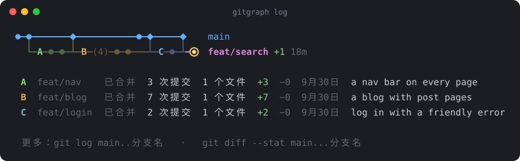
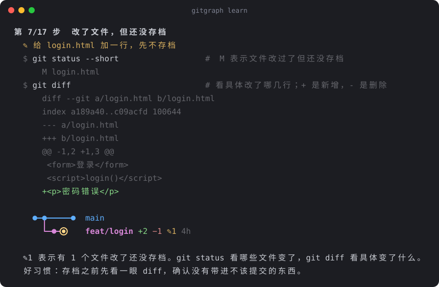

# claude-statusline-gitgraph

[English](README.md) · **中文**

大多数状态栏只告诉你"现在在哪个分支"。这个状态栏画出**整段历史的形状**：一张实时更新的横向 git 分支图，就在 Claude Code 输入框下面。主线在上，分支在下，时间从左往右走。



- **一眼看懂**：状态栏里不显示提交说明，只画结构。已经合并的旧分支会变暗，太长的分支会折叠成 `(5)`。
- **信息刚好够用**：`+3 −1` 是比 main 多几次、少几次提交，`↑2 ↓1` 是和远程仓库差几次提交，`✎2` 是有几个文件改了还没提交，`12m` 是离上次提交过了多久。
- **想看细节随时看**：`gitgraph log` 给每一段分支标上字母，并逐段说明它做了什么。
- **顺便学会 git**：`gitgraph learn` 是一套 17 步的 git 入门教程，在临时的练习仓库里动手操作。每条命令都有注释，每一步都能看到图的变化。
- **零依赖**：一个 Python 文件，只用标准库，有 `git` 和 `python3` 就能跑。
- **中英双语**：默认跟随系统语言，用 `--zh` / `--en` 切换。

## 快速开始

```bash
git clone https://github.com/NowhereMan-in-Galaxy/claude-statusline-gitgraph.git ~/tools/claude-statusline-gitgraph
cd ~/tools/claude-statusline-gitgraph

python3 gitgraph.py ~/your/project   # 画出分支图
python3 gitgraph.py log --zh         # 分支图 + 每一段做了什么
python3 gitgraph.py learn --zh       # git 入门教程（按回车一步步走）
python3 gitgraph.py legend --zh      # 符号表
```

## 放进 Claude Code 的状态栏

在 `~/.claude/settings.json` 里加上下面这段（路径换成你 clone 的位置）：

```json
{
  "statusLine": {
    "type": "command",
    "command": "python3 ~/tools/claude-statusline-gitgraph/gitgraph.py --statusline",
    "refreshInterval": 10
  }
}
```

- Claude Code 每轮对话后都会运行一次这个命令，另外每隔 `refreshInterval` 秒再运行一次，并把它的输出显示在输入框下方。
- `--statusline` 会从 Claude Code 传来的信息里读出当前目录，所以换项目时图会自动跟着换。
- 不在 git 仓库里时什么都不输出，状态栏保持空白。

**已经有自己的状态栏脚本？** 在脚本末尾加一行，把图接在原来的内容下面：

```bash
printf '\n%s' "$(python3 ~/tools/claude-statusline-gitgraph/gitgraph.py --color "$cwd")"
```

## 看每一段做了什么：`log`

状态栏平时保持简洁。想知道这张图背后发生了什么时，运行 `log`：图上每一段分支会标一个字母，下面逐段列出这些信息：
- 状态：已合并还是进行中
- 规模：提交数、改动的文件数、增删的行数
- 时间
- 做了什么：已合并的分支用合并说明，还没合并的用最近一次提交的说明



想用一个词就调出来，可以把下面这段存成 `~/.local/bin/gitgraph`，再运行 `chmod +x ~/.local/bin/gitgraph` 让它可以执行：

```sh
#!/bin/sh
case "$1" in
  learn|legend|log) exec python3 "$HOME/tools/claude-statusline-gitgraph/gitgraph.py" "$@" --color ;;
  *)                exec python3 "$HOME/tools/claude-statusline-gitgraph/gitgraph.py" log --color "$@" ;;
esac
```

之后在任何终端里输入 `gitgraph` 就能看，在 Claude Code 里输入 `! gitgraph`。`gitgraph learn`、`gitgraph legend` 也能直接用。

## 用它学 git：`learn`

一套写给新手的动手教程，分五章：
- **每条命令都附一句注释**，说明它在做什么。
- **显示 git 的真实输出**：关键步骤会把 `status`、`diff` 的输出和冲突标记一起显示出来。
- **每一步之后重画分支图**，你能直接看到这条命令改变了什么。

| 章 | 学什么 | 在图上看到什么 |
|---|---|---|
| 一、存档 | `init`、`status`、`add`、`commit`、`log`，以及提交说明的写法 | `●` 一个个出现 |
| 二、分支 | 开分支（以及为什么它不是提交）、`switch`、`diff` | 新的一行、`+2 −1`、`✎1` |
| 三、合并 | 普通合并，再故意制造一次冲突并解决它 | `◆`、`╯`，旧分支变暗 |
| 四、远程仓库 | 用一个本地文件夹模拟 GitHub，演示 `push`、`fetch`、`pull` | `↑2`、`↓1` 出现又消失 |
| 五、进阶 | 同时开多个分支、长分支折叠 | `├`、`(6)` |

教程最后附一页"好习惯"和一页"常用命令"速查。整个教程都在临时的练习仓库里进行，结束后自动删除，不会碰你的项目。随时可以按 Ctrl+C 退出。



## 看懂这张图

```
●─●───────●─◆───────────◆─●─────────●    main
  ╰─●─●─●───┴─●─(5)─●─●─╯ ├─●─●          feat/search +2 −1
                          ╰─────●─●───◉  feat/theme +3 −1 ✎2 1h
```

| 符号 | 意思 |
|---|---|
| `●` | 一次提交（一个存档点） |
| `◉` | 你现在所在的位置（HEAD） |
| `◆` | 合并提交：有分支在这里并回主线 |
| `(5)` | 折叠起来的 5 次提交 |
| `╰` `╯` | 分支从这里分出去 / 在这里合并回来 |
| `├` | 两个分支从同一个存档点分出去 |
| `┴` | 一个分支刚合并，下一个紧接着分出去 |
| `┼` | 两条线在这里交叉而过 |
| `┄` | 分叉点太早，不在图里 |
| 暗色的线 | 已经合并完的旧分支 |
| `+3` / `−1` | 比 main 多 3 次 / 少 1 次提交 |
| `↑2` / `↓1` | 还有 2 次提交没推送 / 远程有 1 次提交没拉下来 |
| `✎2` | 有 2 个文件改了还没提交 |
| `1h` | 离这个分支上次提交过了多久（m 分钟 · h 小时 · d 天） |
| `+2 more` | 还有 2 个分支放不下没画出来 |
| **加粗的分支名** | 你现在所在的分支 |

## 调整

| `gitgraph.py` 里的常量 | 默认 | 作用 |
|---|---|---|
| `MAX_COLS` | 30 | 最多画多少列，决定图有多宽 |
| `MAX_ROWS` | 3 | main 下面最多画几行分支 |
| `FOLD_OVER` | 4 | 一个分支连续超过几次提交就折叠 |
| `COLORS` | — | 各部分的颜色（终端 256 色编号） |

- **颜色**：输出被其他程序接走时（比如存进文件、交给另一个脚本）会自动去掉颜色。如果接收方能显示颜色，比如你自己的状态栏脚本或 Claude Code 里的 `!` 命令，就加上 `--color`。`--no-color` 或环境变量 `NO_COLOR=1` 可以关闭颜色。
- **语言**：默认跟随系统的 `LANG` 设置。`--zh` / `--en` 只对这一次运行生效，设置环境变量 `GITGRAPH_LANG=zh` 则会一直用中文。

## 它是怎么画出来的

见 [docs/how-it-works.zh-CN.md](docs/how-it-works.zh-CN.md)，里面讲了三件事：
- 怎么从 git 读出分叉和合并；
- 为什么按拓扑顺序排列，而不是按提交时间；
- 几条线交在同一格时，拐角符号是怎么合成的。

README 里的图片都是用真实的 `gitgraph` 输出生成的，生成脚本是 `python3 scripts/make_images.py`。

## 许可证

[MIT](LICENSE)
